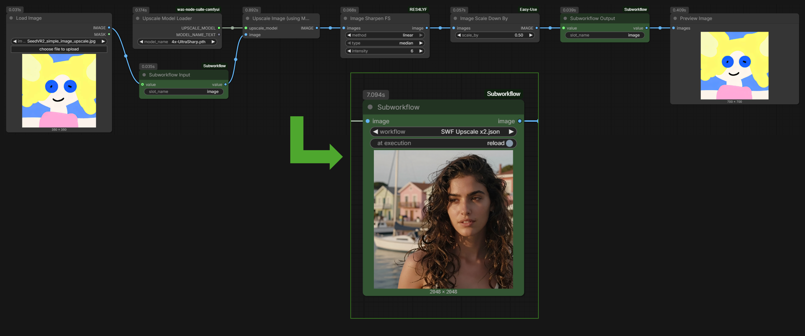
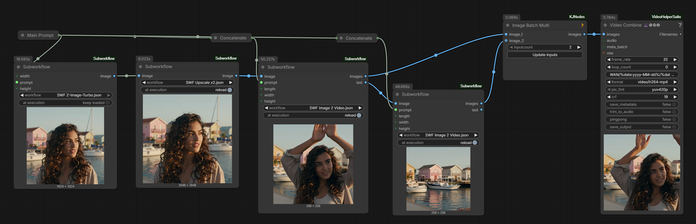
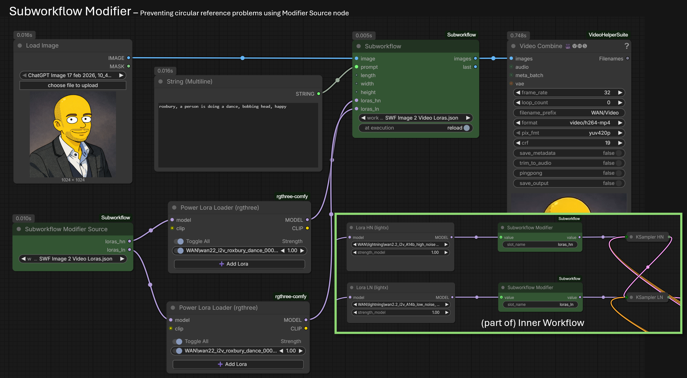
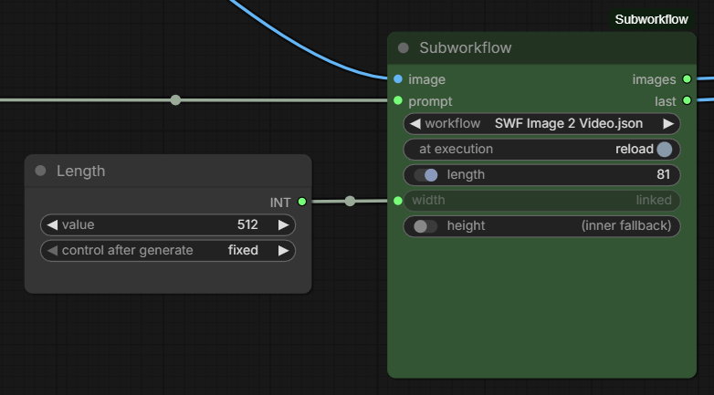

# ComfyUI-Subworkflow 

ComfyUI-Subworkflow adds reusable workflow boundaries to ComfyUI. It lets one workflow expose named inputs and outputs, then lets another workflow execute it through a single `Subworkflow` node.



----------------

# Subworkflow custom nodes

To control the workflow boundaries, this extension adds several custom nodes: `Subworkflow`, `Subworkflow Input`, and `Subworkflow Output`. 
These nodes work together to load and execute inner workflows while exposing their inputs and outputs on the outer workflow.

To resolve circular reference problems when an inner workflow output needs to be modified and passed back into the inner workflow input, `Subworkflow Modifier` and `Subworkflow Modifier Source` nodes are added as well.

## Node: Subworkflow

Loads a workflow from `ComfyUI/user/default/workflows` and expands it into the current prompt at execution time. The selected inner workflow determines the visible input and output slots on the node.

**Inputs:**
- `workflow`: workflow file to execute (the inner workflow).
- `at execution`: controls whether the inner workflow file is reloaded on every execution or a loaded workflow instance is kept.

Outputs are dynamic and are inferred from the inner workflow's `Subworkflow Output` nodes.

In the example below you can see several workflows are used, and the image to video workflow is used several times:


*Example workflow with several Subworkflow nodes with loaded inner workflows*

## Node: Subworkflow (from URL)

Loads a workflow from a URL and expands it into the current prompt at execution time. The selected inner workflow determines the visible input and output slots on the node.

**Inputs:**
- `url`: absolute `http://` or `https://` URL that returns a workflow JSON file.
- `at execution`: controls whether the inner workflow URL is reloaded on every execution or a loaded workflow instance is kept.
- `verify ssl`: controls whether HTTPS certificate validation is enforced while loading from URL (in case of Python SSL certificate issues with certain endpoints, such as GitHub raw URLs). Use with caution and only for trusted sources.

**Outputs:** dynamic and are inferred from the inner workflow's `Subworkflow Output` nodes.

## Node: Subworkflow Input

Marks an input boundary inside a reusable workflow. The `slot_name` widget controls the label shown on the outer `Subworkflow` node. The value type is inferred from the connected node.

When used directly in a normal workflow, `Subworkflow Input` must have its `value` input linked for correct execution.
That linked node is ignored when used as inner workflow inside `Subworkflow`, and the value is instead provided by the outer `Subworkflow` node input. 
If no linked node is attached to the `Subworkflow` input, the linked node of the `Subworkflow Input` is used as fallback. This allows for optional inputs on the inner workflow.
This structure allows for default values to be set on the input, and to use the same workflow as standalone or as inner workflow without changes.

## Node: Subworkflow Output

Marks an output boundary inside a reusable workflow. The `slot_name` widget controls the label shown on the outer `Subworkflow` node. The output type is inferred from the connected value.

`Subworkflow Output` also behaves as a passthrough when other nodes inside the same inner workflow consume its output.

## Node: Subworkflow Modifier

The `Subworkflow Modifier` node allows for modifying a value from the inner workflow and passing it back into the inner workflow without creating circular reference problems.
Used inside the inner workflow and accessed from outer workflow by the `Subworkflow Modifier Source` node.

## Node: Subworkflow Modifier Source

The `Subworkflow Modifier Source` node is used in combination with the `Subworkflow Modifier` node. 
It allows for accessing the modified value from the `Subworkflow Modifier` node within the inner workflow.
This is a separate node to avoid circular reference problems that would arise if the modified value was passed directly from the `Subworkflow Modifier` node back into the inner workflow.
See Features section below for an example of how to use these nodes together.

----------------

# Installation

How get the Subworkflow custom nodes in ComfyUI.

## From ComfyUI Custom Nodes UI

1. Open the ComfyUI Manager
2. Open the Custom Nodes Manager
3. Make sure to remove filters
4. Search for "Subworkflow (re-useable workflows)" and click install.
5. Restart ComfyUI after installation. Browser also require a hard refresh.

## From GitHub Repository

Clone this repository into your ComfyUI custom nodes directory:

```bash
cd ComfyUI/custom_nodes
git clone https://github.com/eniewold/ComfyUI-Subworkflow.git
```

Restart ComfyUI after installation or after Python changes. Browser-side updates also require a hard refresh. 
Note that there are no library dependencies outside of the standard Python environment bundled with ComfyUI.

**FEEDBACK WELCOME**: This is an early release and work in progress. Expect bugs and breaking changes as I continue development. 
Please report any issues you encounter, especially those unrelated to the known issues below, and share your use cases and feedback. 
Check below on how to get debug messages in the log files. 

## Simple Step-by-Step Usage Example

1. Adjust an (inner) workflow and add one or more `Subworkflow Input` nodes where external values should enter.
2. Add one or more `Subworkflow Output` nodes where values should leave the inner workflow.
3. Set meaningful `slot_name` values on each input and output boundary.
4. Save the inner workflow (keep default folder `ComfyUI/user/default/workflows`).
5. In another workflow, add a `Subworkflow` node and select the saved workflow file (now called the inner workflow).
6. Connect or set value for the input and output slots.

----------------

# Features

Highlights of the current features of this extension. See the example workflows and notes below for more details and use cases.

## Modifier Nodes 

If you want to expose an output from the inner workflow, modify it (for example, add loras to a model), and then pass it back into the inner workflow, you can use the `Subworkflow Modifier` node in combination with `Subworkflow Modifier Source` nodes. 
The modifier node takes an input value, passes it through to its output, and also makes it available as a source for modifier sources. The modifier sources can be used in the inner workflow to access the modified value without creating circular reference problems.



## Manual Value Entry 

For `Subworkflow Input` nodes with primitive number types, you can now set their value directly in the `Subworkflow` node without needing to link a separate primitive number node. 
This allows for more compact workflows when you simply want to set a number for the inner workflow.
When an node is linked to the input of such a node, the linked node value will take precedence over the set value.
The value input can also be disabled; the linked input of the inner input will use as fallback value. 



----------------

# Notes

Some notes and observations about the behavior and development of this extension.

- Developed and tested with ComfyUI version 0.18.2.
- The `Subworkflow` node sets the input and output parameters when loading the inner workflow. This load is executed when the outer workflow is loaded. When linked nodes do not match the expected input types provided by `Subworkflow Output` and `Subworkflow Input` from inner workflow, the links are severed silently. 
- The `Subworkflow Output` node will not pass through values to it's output when it's used as inner workflow. When the workflow is executed standalone, it will pass through values transparently as expected. 
- The `Subworkflow Input` will ignore any linked nodes to the input values when used as inner workflow. When the workflow is executed standalone, it will use the linked values transparently as expected.
- If the input of a corresponding `Subworkflow Input` on the `Subworkflow` node is not linked, the inner workflow will use the linked node of the `Subworkflow Input` node. This allows for optional inputs on the inner workflow.
- The `Subworkflow` node loads the values from the selected inner workflow as is; including seed numbers. When `at execution` is set to `keep loaded`, the seed value will be updated by the inner workflow if it has a randomize-after-processing node linked to the `Subworkflow Input`. This allows for workflows that need to update their own input values, such as a seed that should randomize on every execution but also be exposed for linking to other nodes.
- The `Subworkflow` node will keep the loaded file untouched, it will never save any changes to the inner workflow back to the file. 
- A large portion of the source code has been created using AI assistance. Without this, the project would not have been possible for me at this time. I have done my best to review and test the generated code, but there may be edge cases or bugs that I have missed. Please report any issues you encounter.

### Subworkflow vs Subgraph

**Note:** *Subworkflows are fundametally different from subgraphs. Subworkflow offers a way to reuse entire workflows as nodes in other workflows, while subgraphs are a way to reuse a group of nodes within the same workflow.*

### Use Cases

- Reuse a prompt, sampler, or decode chain across multiple workflows.
- Wrap model-specific pipelines behind a small set of named inputs and outputs.
- Build compact higher-level workflows from tested lower-level workflows.
- Keep experimental graph sections isolated while exposing only the inputs and outputs that matter.
- Share common workflow pieces without copying all nodes into every workflow.

### Supported Shapes

ComfyUI workflow JSON appears in a few different shapes depending on how it was saved and which nodes are used. This extension currently supports:

- UI-format workflows with top-level `nodes` and `links` arrays.
- API-format workflows where each node is keyed by node id and has `class_type` and `inputs`.
- UI-format native ComfyUI subgraphs stored under `definitions.subgraphs`.
- UI node class names stored directly in `node.type`.
- UI node class names stored in `node.properties["Node name for S&R"]` when `node.type` contains a UUID.
- UI links in classic array form: `[id, source_node, source_slot, target_node, target_slot, type]`.
- UI links in object form with `id`, `origin_id`, `origin_slot`, `target_id`, and `target_slot`.
- UI `widgets_values` stored as ordered lists.
- UI `widgets_values` stored as dictionaries keyed by widget/input name.
- Widget-backed `COMBO`, `INT`, `FLOAT`, `STRING`, and `BOOLEAN` inputs, including legacy list-based combo definitions and control-after-generate companion widgets.
- Boundary nodes used as passthroughs when other nodes connect to `Subworkflow Input` or `Subworkflow Output` outputs.

`Subworkflow Input` and `Subworkflow Output` boundary names are read from their `slot_name` widget. For UI workflows this can come from either list-style or dictionary-style `widgets_values`; for API workflows it is read from the node's `inputs.slot_name`.

### Known Issues

- [ ] The `Subworkflow` node progress can exceed 100%, sometimes reaching about 200%. Check with the upscale workflow example.
- [ ] Used paths with macro elements are not formatted currectly when used in inner workflow? (use Video Combine node with %date:yyyy-MM-dd%/WAN/Video)
- [ ] Green progress borders appear on more than one node when executing a inner workflow as part of a larger workflow. These borders should be limited to the currently executing node(s) outer workflow.
- [ ] The order if inputs/outputs on the `Subworkflow` node is undetermined (probably based on the order of nodes in the inner workflow JSON). Consider adding an option to control this order.
- [ ] When a node `Subworkflow Input` is used inside a subgraph, it will not be detected as a boundary node and will not be exposed on the `Subworkflow` node.

### Version History

- v1.2.1 - Removed the maximum number of inputs and outputs on the `Subworkflow` node (was previously set to 8).
- v1.2.0 - Added manual value entry for primitive `Subworkflow Input` input nodes on the `Subworkflow` node. Check README features section for details.
- v1.1.0 - Added `Subworkflow Modifier`, `Subworkflow Modifier Source` (+ from URL) nodes. Combining these nodes in inner and outer workflows allows for circular links between an inner workflow input and output, without circular reference problems. 
- v1.0.1 - UI only nodes are now supported in inner workflows, no longer raising and error when loading.
- v1.0.0 - Initial release of the four custom nodes and workflow loading and execution behavior.

### Debug Logging

*Backend debug logging* is controlled by the `COMFYUI_SUBWORKFLOW_DEBUG` environment variable.

- When set to `true`, trace-style Python logs are enabled.
- When unset or set to `false`, only normal release logs are shown.

When using ComfyUI portable, adjust the launch script and add the following after 'setlocal' line:
```bash
...
setlocal
set COMFYUI_SUBWORKFLOW_DEBUG=1
...
```

*Frontend debug logging* is separate and can be enabled in the browser console:

- Enable it by setting the `swf_debug` item in `localStorage` to `"1"`:

```js
localStorage.setItem("swf_debug", "1")
```
